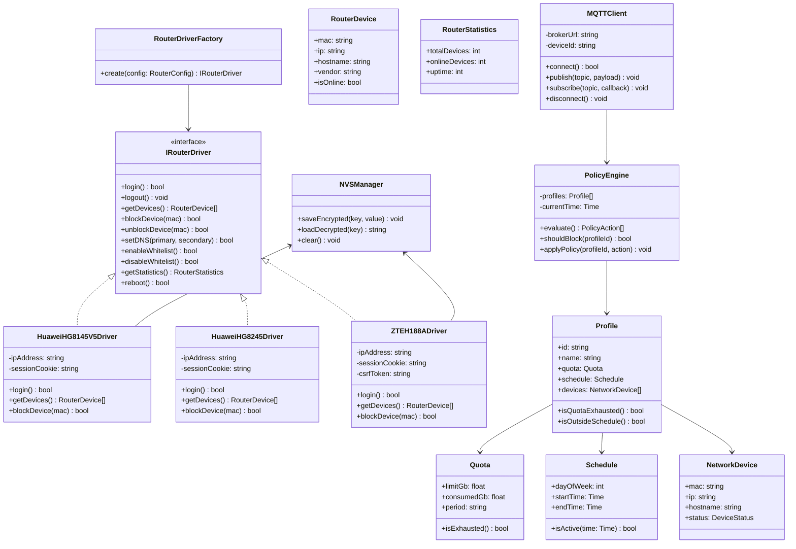

# Class Diagram

```mermaid
classDiagram
    class IRouterDriver {
        <<interface>>
        +login() bool
        +logout() void
        +getDevices() RouterDevice[]
        +blockDevice(mac) bool
        +unblockDevice(mac) bool
        +setDNS(primary, secondary) bool
        +enableWhitelist() bool
        +disableWhitelist() bool
        +getStatistics() RouterStatistics
        +reboot() bool
    }

    class HuaweiHG8145V5Driver {
        -ipAddress: string
        -sessionCookie: string
        +login() bool
        +getDevices() RouterDevice[]
        +blockDevice(mac) bool
    }

    class HuaweiHG8245Driver {
        -ipAddress: string
        -sessionCookie: string
        +login() bool
        +getDevices() RouterDevice[]
        +blockDevice(mac) bool
    }

    class ZTEH188ADriver {
        -ipAddress: string
        -sessionCookie: string
        -csrfToken: string
        +login() bool
        +getDevices() RouterDevice[]
        +blockDevice(mac) bool
    }

    class RouterDriverFactory {
        +create(config: RouterConfig) IRouterDriver
    }

    class PolicyEngine {
        -profiles: Profile[]
        -currentTime: Time
        +evaluate() PolicyAction[]
        +shouldBlock(profileId) bool
        +applyPolicy(profileId, action) void
    }

    class Profile {
        +id: string
        +name: string
        +quota: Quota
        +schedule: Schedule
        +devices: NetworkDevice[]
        +isQuotaExhausted() bool
        +isOutsideSchedule() bool
    }

    class Quota {
        +limitGb: float
        +consumedGb: float
        +period: string
        +isExhausted() bool
    }

    class Schedule {
        +dayOfWeek: int
        +startTime: Time
        +endTime: Time
        +isActive(time: Time) bool
    }

    class NetworkDevice {
        +mac: string
        +ip: string
        +hostname: string
        +status: DeviceStatus
    }

    class RouterDevice {
        +mac: string
        +ip: string
        +hostname: string
        +vendor: string
        +isOnline: bool
    }

    class RouterStatistics {
        +totalDevices: int
        +onlineDevices: int
        +uptime: int
    }

    class MQTTClient {
        -brokerUrl: string
        -deviceId: string
        +connect() bool
        +publish(topic, payload) void
        +subscribe(topic, callback) void
        +disconnect() void
    }

    class NVSManager {
        +saveEncrypted(key, value) void
        +loadDecrypted(key) string
        +clear() void
    }

    IRouterDriver <|.. HuaweiHG8145V5Driver
    IRouterDriver <|.. HuaweiHG8245Driver
    IRouterDriver <|.. ZTEH188ADriver
    RouterDriverFactory --> IRouterDriver
    PolicyEngine --> Profile
    Profile --> Quota
    Profile --> Schedule
    Profile --> NetworkDevice
    MQTTClient --> PolicyEngine
    NVSManager <-- HuaweiHG8145V5Driver
    NVSManager <-- ZTEH188ADriver
```
