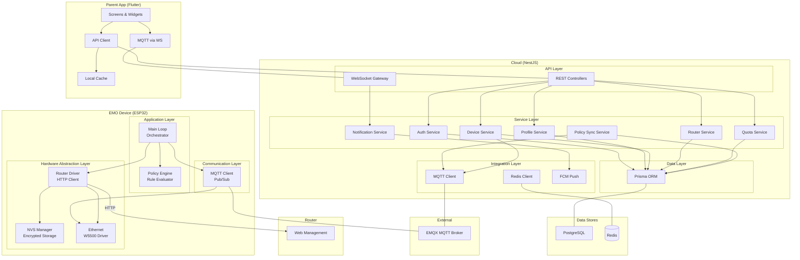

# Component Diagram

```mermaid
graph TB
    subgraph "EMO Device (ESP32)"
        subgraph "Application Layer"
            MAIN[Main Loop<br/>Orchestrator]
            PE[Policy Engine<br/>Rule Evaluator]
        end
        
        subgraph "Communication Layer"
            MQTT[MQTT Client<br/>Pub/Sub]
        end
        
        subgraph "Hardware Abstraction Layer"
            RDRV[Router Driver<br/>HTTP Client]
            NVS[NVS Manager<br/>Encrypted Storage]
            ETH[Ethernet<br/>W5500 Driver]
        end
        
        MAIN --> PE
        MAIN --> MQTT
        MAIN --> RDRV
        RDRV --> NVS
        MQTT --> ETH
        RDRV --> ETH
    end

    subgraph "Cloud (NestJS)"
        subgraph "API Layer"
            REST[REST Controllers]
            WS[WebSocket Gateway]
        end
        
        subgraph "Service Layer"
            AUTH[Auth Service]
            PROFILE[Profile Service]
            DEVICE[Device Service]
            ROUTER[Router Service]
            QUOTA[Quota Service]
            NOTIF[Notification Service]
            POLICY[Policy Sync Service]
        end
        
        subgraph "Data Layer"
            PRISMA[Prisma ORM]
        end
        
        subgraph "Integration Layer"
            MQTT_CLI[MQTT Client]
            REDIS_CLI[Redis Client]
            FCM[FCM Push]
        end
        
        REST --> AUTH
        REST --> PROFILE
        REST --> DEVICE
        REST --> ROUTER
        REST --> QUOTA
        WS --> NOTIF
        
        AUTH --> PRISMA
        PROFILE --> PRISMA
        DEVICE --> PRISMA
        ROUTER --> PRISMA
        QUOTA --> PRISMA
        NOTIF --> FCM
        
        POLICY --> MQTT_CLI
        POLICY --> PRISMA
        DEVICE --> MQTT_CLI
    end

    subgraph "Data Stores"
        PG[PostgreSQL]
        RD[(Redis)]
    end

    subgraph "External"
        EMQX[EMQX MQTT Broker]
    end

    subgraph "Parent App (Flutter)"
        UI[Screens & Widgets]
        API_CLI[API Client]
        MQTT_WS[MQTT via WS]
        CACHE[Local Cache]
        
        UI --> API_CLI
        UI --> MQTT_WS
        API_CLI --> CACHE
    end

    subgraph "Router"
        WEB_UI[Web Management]
    end

    PRISMA --- PG
    REDIS_CLI --- RD
    MQTT_CLI --- EMQX
    MQTT --- EMQX
    API_CLI --- REST
    MQTT_WS --- WS
    RDRV -- "HTTP" --> WEB_UI
```
