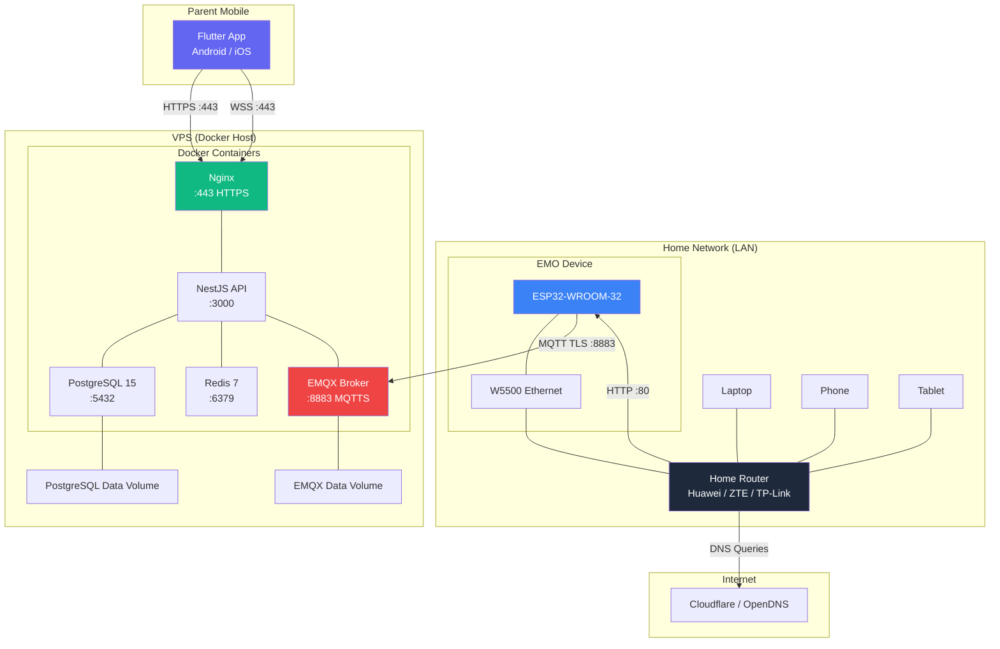

# Deployment Diagram

```mermaid
graph TB
    subgraph "Home Network (LAN)"
        subgraph "EMO Device"
            ESP[ESP32-WROOM-32]
            ETH[W5500 Ethernet]
        end
        
        ROUTER[Home Router<br/>Huawei / ZTE / TP-Link]
        DEV1[Laptop]
        DEV2[Phone]
        DEV3[Tablet]
        
        ESP --- ETH
        ETH --- ROUTER
        DEV1 --- ROUTER
        DEV2 --- ROUTER
        DEV3 --- ROUTER
    end

    subgraph "Internet"
        DNS[Cloudflare / OpenDNS]
    end

    subgraph "VPS (Docker Host)"
        subgraph "Docker Containers"
            API[NestJS API<br/>:3000]
            PG[PostgreSQL 15<br/>:5432]
            REDIS[Redis 7<br/>:6379]
            EMQX[EMQX Broker<br/>:8883 MQTTS]
            NGINX[Nginx<br/>:443 HTTPS]
        end
        
        VOLUME1[PostgreSQL Data Volume]
        VOLUME2[EMQX Data Volume]
        
        API --- PG
        API --- REDIS
        API --- EMQX
        NGINX --- API
        PG --- VOLUME1
        EMQX --- VOLUME2
    end

    subgraph "Parent Mobile"
        FLUTTER[Flutter App<br/>Android / iOS]
    end

    ROUTER -- "DNS Queries" --> DNS
    ESP -- "MQTT TLS :8883" --> EMQX
    FLUTTER -- "HTTPS :443" --> NGINX
    FLUTTER -- "WSS :443" --> NGINX
    ROUTER -- "HTTP :80" --> ESP

    style ESP fill:#3b82f6,color:#fff
    style ROUTER fill:#1e293b,color:#fff
    style EMQX fill:#ef4444,color:#fff
    style NGINX fill:#10b981,color:#fff
    style FLUTTER fill:#6366f1,color:#fff
```
