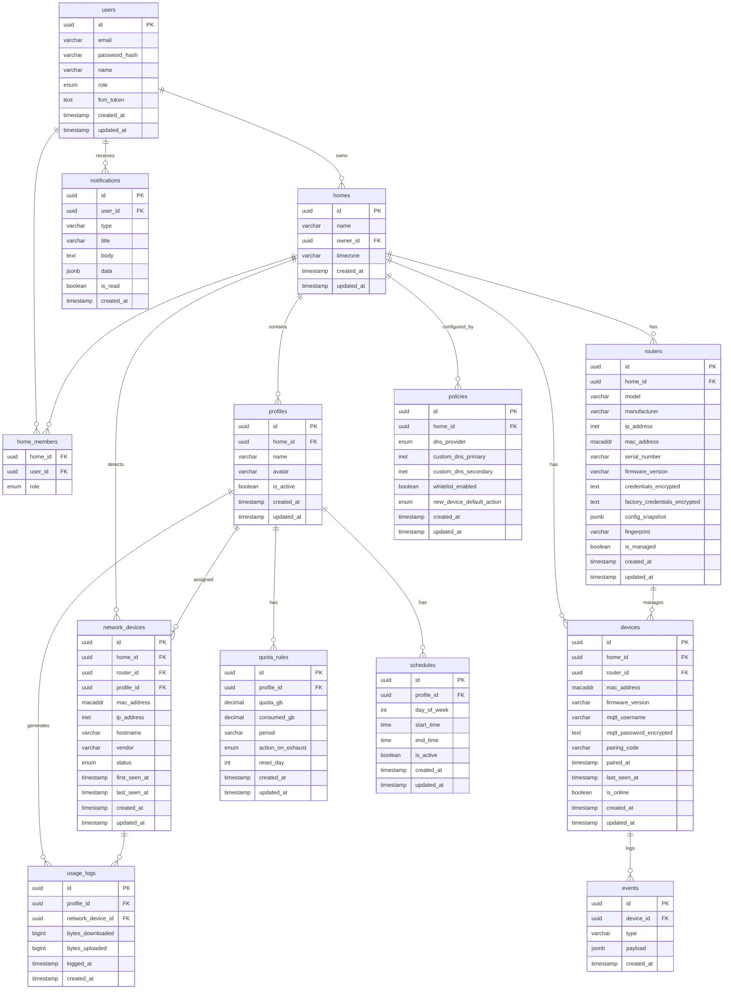

# Entity Relationship Diagram

```mermaid
erDiagram
    users {
        uuid id PK
        varchar email
        varchar password_hash
        varchar name
        enum role
        text fcm_token
        timestamp created_at
        timestamp updated_at
    }

    homes {
        uuid id PK
        varchar name
        uuid owner_id FK
        varchar timezone
        timestamp created_at
        timestamp updated_at
    }

    home_members {
        uuid home_id FK
        uuid user_id FK
        enum role
    }

    profiles {
        uuid id PK
        uuid home_id FK
        varchar name
        varchar avatar
        boolean is_active
        timestamp created_at
        timestamp updated_at
    }

    routers {
        uuid id PK
        uuid home_id FK
        varchar model
        varchar manufacturer
        inet ip_address
        macaddr mac_address
        varchar serial_number
        varchar firmware_version
        text credentials_encrypted
        text factory_credentials_encrypted
        jsonb config_snapshot
        varchar fingerprint
        boolean is_managed
        timestamp created_at
        timestamp updated_at
    }

    devices {
        uuid id PK
        uuid home_id FK
        uuid router_id FK
        macaddr mac_address
        varchar firmware_version
        varchar mqtt_username
        text mqtt_password_encrypted
        varchar pairing_code
        timestamp paired_at
        timestamp last_seen_at
        boolean is_online
        timestamp created_at
        timestamp updated_at
    }

    network_devices {
        uuid id PK
        uuid home_id FK
        uuid router_id FK
        uuid profile_id FK
        macaddr mac_address
        inet ip_address
        varchar hostname
        varchar vendor
        enum status
        timestamp first_seen_at
        timestamp last_seen_at
        timestamp created_at
        timestamp updated_at
    }

    quota_rules {
        uuid id PK
        uuid profile_id FK
        decimal quota_gb
        decimal consumed_gb
        varchar period
        enum action_on_exhaust
        int reset_day
        timestamp created_at
        timestamp updated_at
    }

    schedules {
        uuid id PK
        uuid profile_id FK
        int day_of_week
        time start_time
        time end_time
        boolean is_active
        timestamp created_at
        timestamp updated_at
    }

    usage_logs {
        uuid id PK
        uuid profile_id FK
        uuid network_device_id FK
        bigint bytes_downloaded
        bigint bytes_uploaded
        timestamp logged_at
        timestamp created_at
    }

    policies {
        uuid id PK
        uuid home_id FK
        enum dns_provider
        inet custom_dns_primary
        inet custom_dns_secondary
        boolean whitelist_enabled
        enum new_device_default_action
        timestamp created_at
        timestamp updated_at
    }

    notifications {
        uuid id PK
        uuid user_id FK
        varchar type
        varchar title
        text body
        jsonb data
        boolean is_read
        timestamp created_at
    }

    events {
        uuid id PK
        uuid device_id FK
        varchar type
        jsonb payload
        timestamp created_at
    }

    users ||--o{ homes : owns
    users ||--o{ home_members : ""
    homes ||--o{ home_members : ""
    homes ||--o{ profiles : contains
    homes ||--o{ routers : has
    homes ||--o{ devices : has
    homes ||--o{ network_devices : detects
    homes ||--o{ policies : configured_by
    profiles ||--o{ network_devices : assigned
    profiles ||--o{ quota_rules : has
    profiles ||--o{ schedules : has
    profiles ||--o{ usage_logs : generates
    network_devices ||--o{ usage_logs : ""
    routers ||--o{ devices : manages
    users ||--o{ notifications : receives
    devices ||--o{ events : logs
```
