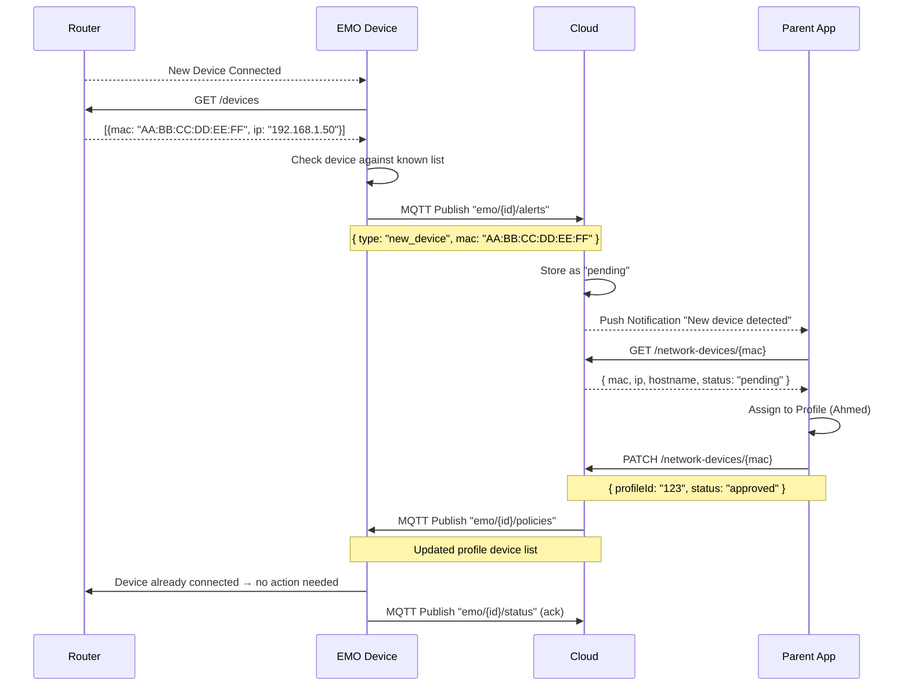
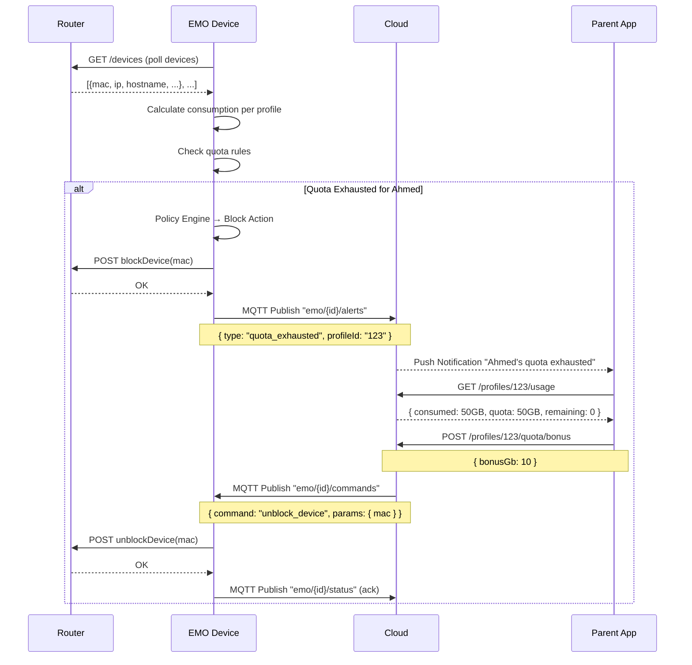
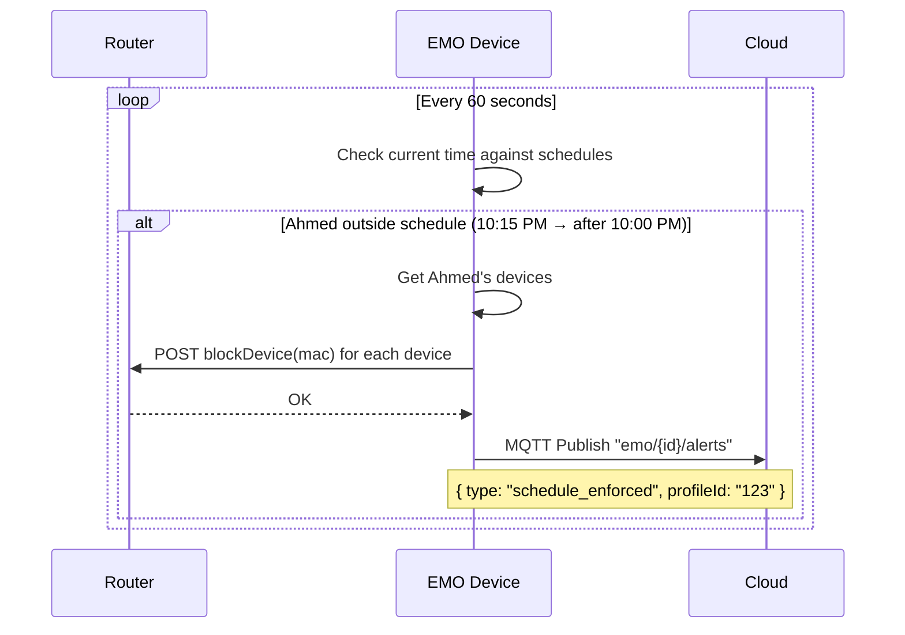
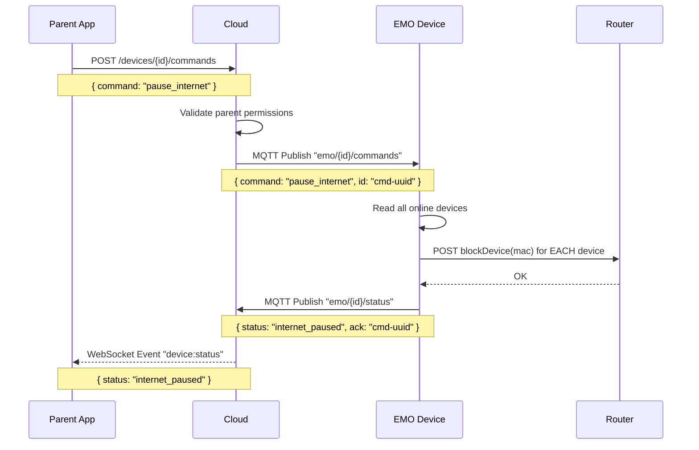
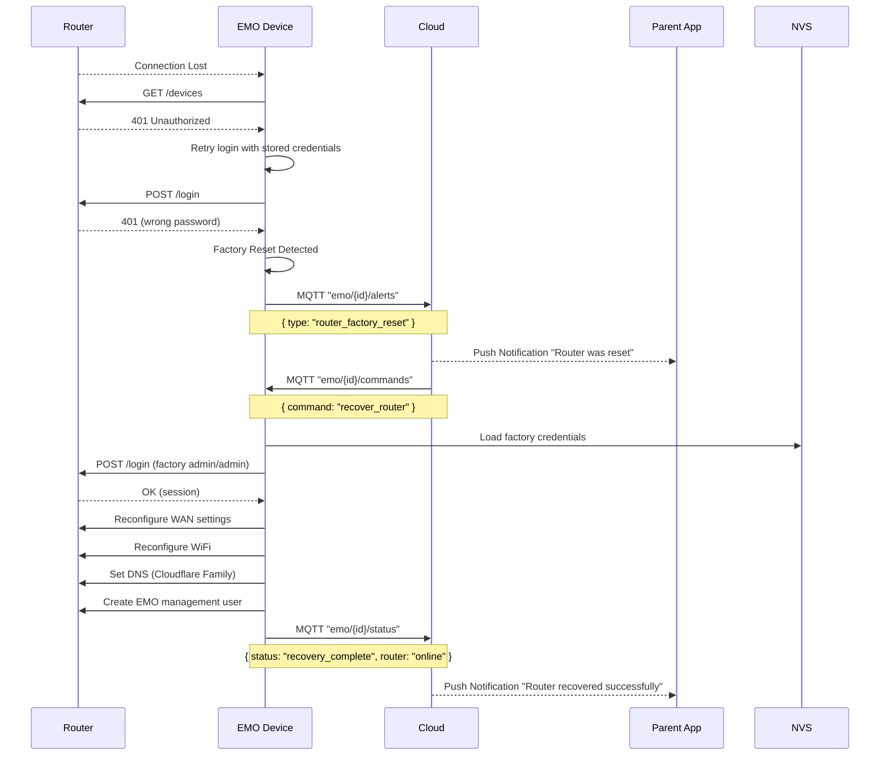

# Sequence Diagrams

## 1. Device Approval Flow

```mermaid
sequenceDiagram
    participant Router
    participant ESP32 as EMO Device
    participant Cloud
    participant Parent as Parent App

    Router-->>ESP32: New Device Connected
    ESP32->>Router: GET /devices
    Router-->>ESP32: [{mac: "AA:BB:CC:DD:EE:FF", ip: "192.168.1.50"}]
    
    ESP32->>ESP32: Check device against known list
    ESP32->>Cloud: MQTT Publish "emo/{id}/alerts"
    Note over ESP32,Cloud: { type: "new_device", mac: "AA:BB:CC:DD:EE:FF" }
    
    Cloud->>Cloud: Store as "pending"
    Cloud-->>Parent: Push Notification "New device detected"
    
    Parent->>Cloud: GET /network-devices/{mac}
    Cloud-->>Parent: { mac, ip, hostname, status: "pending" }
    
    Parent->>Parent: Assign to Profile (Ahmed)
    Parent->>Cloud: PATCH /network-devices/{mac}
    Note over Parent,Cloud: { profileId: "123", status: "approved" }
    
    Cloud->>ESP32: MQTT Publish "emo/{id}/policies"
    Note over Cloud,ESP32: Updated profile device list
    
    ESP32->>Router: Device already connected → no action needed
    ESP32->>Cloud: MQTT Publish "emo/{id}/status" (ack)
```

## 2. Quota Exhausted → Block Device

```mermaid
sequenceDiagram
    participant Router
    participant ESP32 as EMO Device
    participant Cloud
    participant Parent as Parent App

    ESP32->>Router: GET /devices (poll devices)
    Router-->>ESP32: [{mac, ip, hostname, ...}, ...]
    
    ESP32->>ESP32: Calculate consumption per profile
    ESP32->>ESP32: Check quota rules
    
    alt Quota Exhausted for Ahmed
        ESP32->>ESP32: Policy Engine → Block Action
        ESP32->>Router: POST blockDevice(mac)
        Router-->>ESP32: OK
        
        ESP32->>Cloud: MQTT Publish "emo/{id}/alerts"
        Note over ESP32,Cloud: { type: "quota_exhausted", profileId: "123" }
        
        Cloud-->>Parent: Push Notification "Ahmed's quota exhausted"
        Parent->>Cloud: GET /profiles/123/usage
        Cloud-->>Parent: { consumed: 50GB, quota: 50GB, remaining: 0 }
        
        Parent->>Cloud: POST /profiles/123/quota/bonus
        Note over Parent,Cloud: { bonusGb: 10 }
        
        Cloud->>ESP32: MQTT Publish "emo/{id}/commands"
        Note over Cloud,ESP32: { command: "unblock_device", params: { mac } }
        
        ESP32->>Router: POST unblockDevice(mac)
        Router-->>ESP32: OK
        
        ESP32->>Cloud: MQTT Publish "emo/{id}/status" (ack)
    end
```

## 3. Time Schedule Enforcement

```mermaid
sequenceDiagram
    participant Router
    participant ESP32 as EMO Device
    participant Cloud

    loop Every 60 seconds
        ESP32->>ESP32: Check current time against schedules
        
        alt Ahmed outside schedule (10:15 PM → after 10:00 PM)
            ESP32->>ESP32: Get Ahmed's devices
            ESP32->>Router: POST blockDevice(mac) for each device
            Router-->>ESP32: OK
            
            ESP32->>Cloud: MQTT Publish "emo/{id}/alerts"
            Note over ESP32,Cloud: { type: "schedule_enforced", profileId: "123" }
        end
    end
```

## 4. Remote Pause Internet

```mermaid
sequenceDiagram
    participant Parent as Parent App
    participant Cloud
    participant ESP32 as EMO Device
    participant Router

    Parent->>Cloud: POST /devices/{id}/commands
    Note over Parent,Cloud: { command: "pause_internet" }
    
    Cloud->>Cloud: Validate parent permissions
    Cloud->>ESP32: MQTT Publish "emo/{id}/commands"
    Note over Cloud,ESP32: { command: "pause_internet", id: "cmd-uuid" }
    
    ESP32->>ESP32: Read all online devices
    ESP32->>Router: POST blockDevice(mac) for EACH device
    Router-->>ESP32: OK
    
    ESP32->>Cloud: MQTT Publish "emo/{id}/status"
    Note over ESP32,Cloud: { status: "internet_paused", ack: "cmd-uuid" }
    
    Cloud-->>Parent: WebSocket Event "device:status"
    Note over Cloud,Parent: { status: "internet_paused" }
```

## 5. Router Recovery After Factory Reset

```mermaid
sequenceDiagram
    participant Router
    participant ESP32 as EMO Device
    participant Cloud
    participant Parent as Parent App

    Router-->>ESP32: Connection Lost
    ESP32->>Router: GET /devices
    Router-->>ESP32: 401 Unauthorized
    
    ESP32->>ESP32: Retry login with stored credentials
    ESP32->>Router: POST /login
    Router-->>ESP32: 401 (wrong password)
    
    ESP32->>ESP32: Factory Reset Detected
    ESP32->>Cloud: MQTT "emo/{id}/alerts"
    Note over ESP32,Cloud: { type: "router_factory_reset" }
    
    Cloud-->>Parent: Push Notification "Router was reset"
    Cloud->>ESP32: MQTT "emo/{id}/commands"
    Note over Cloud,ESP32: { command: "recover_router" }
    
    ESP32->>NVS: Load factory credentials
    ESP32->>Router: POST /login (factory admin/admin)
    Router-->>ESP32: OK (session)
    
    ESP32->>Router: Reconfigure WAN settings
    ESP32->>Router: Reconfigure WiFi
    ESP32->>Router: Set DNS (Cloudflare Family)
    ESP32->>Router: Create EMO management user
    
    ESP32->>Cloud: MQTT "emo/{id}/status"
    Note over ESP32,Cloud: { status: "recovery_complete", router: "online" }
    
    Cloud-->>Parent: Push Notification "Router recovered successfully"
```
