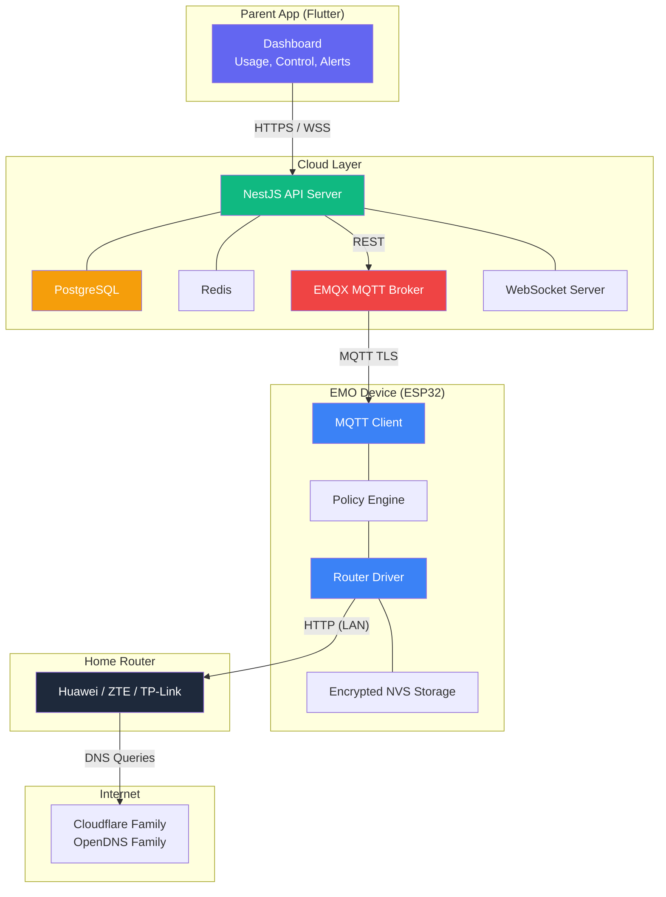

# System Architecture Diagram

```mermaid
graph TB
    subgraph "Parent App (Flutter)"
        PA[Dashboard<br/>Usage, Control, Alerts]
    end

    subgraph "Cloud Layer"
        API[NestJS API Server]
        DB[PostgreSQL]
        REDIS[Redis]
        MQTT_BROKER[EMQX MQTT Broker]
        WS[WebSocket Server]
        
        API --- DB
        API --- REDIS
        API --- WS
    end

    subgraph "EMO Device (ESP32)"
        MQTT_CLI[MQTT Client]
        POLICY[Policy Engine]
        ROUTER_DRV[Router Driver]
        NVS[Encrypted NVS Storage]
        
        MQTT_CLI --- POLICY
        POLICY --- ROUTER_DRV
        ROUTER_DRV --- NVS
    end

    subgraph "Home Router"
        RTR[Huawei / ZTE / TP-Link]
    end

    subgraph "Internet"
        DNS[Cloudflare Family<br/>OpenDNS Family]
    end

    PA -- "HTTPS / WSS" --> API
    API -- "REST" --> MQTT_BROKER
    MQTT_BROKER -- "MQTT TLS" --> MQTT_CLI
    ROUTER_DRV -- "HTTP (LAN)" --> RTR
    RTR -- "DNS Queries" --> DNS

    style PA fill:#6366f1,color:#fff
    style API fill:#10b981,color:#fff
    style DB fill:#f59e0b,color:#fff
    style MQTT_BROKER fill:#ef4444,color:#fff
    style MQTT_CLI fill:#3b82f6,color:#fff
    style ROUTER_DRV fill:#3b82f6,color:#fff
    style RTR fill:#1e293b,color:#fff
```
