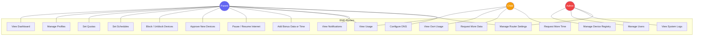

# Use Case Diagram

```mermaid
graph TB
    PARENT((Parent))
    CHILD((Child))
    ADMIN((Admin))

    subgraph "EMO System"
        UC1[View Dashboard]
        UC2[Manage Profiles]
        UC3[Set Quotas]
        UC4[Set Schedules]
        UC5[Block / Unblock Devices]
        UC6[Approve New Devices]
        UC7[Pause / Resume Internet]
        UC8[Add Bonus Data or Time]
        UC9[View Usage]
        UC10[View Notifications]
        UC11[Manage Router Settings]
        UC12[View Own Usage]
        UC13[Request More Data]
        UC14[Request More Time]
        UC15[Manage Device Registry]
        UC16[Manage Users]
        UC17[View System Logs]
        UC18[Configure DNS]
    end

    PARENT --- UC1
    PARENT --- UC2
    PARENT --- UC3
    PARENT --- UC4
    PARENT --- UC5
    PARENT --- UC6
    PARENT --- UC7
    PARENT --- UC8
    PARENT --- UC9
    PARENT --- UC10
    PARENT --- UC11
    PARENT --- UC18

    CHILD --- UC9
    CHILD --- UC12
    CHILD --- UC13
    CHILD --- UC14

    ADMIN --- UC15
    ADMIN --- UC16
    ADMIN --- UC17
    ADMIN --- UC11

    style PARENT fill:#6366f1,color:#fff
    style CHILD fill:#f59e0b,color:#fff
    style ADMIN fill:#ef4444,color:#fff
```
